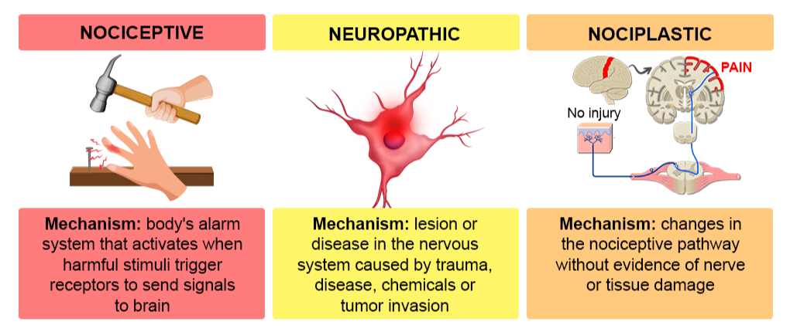

---
title: "Pain Fundamentals: Pain Classification"
---

Pain can be classified by mechanism. This is useful because different mechanisms may require different treatment strategies.

The three major categories are:

- Nociceptive pain
- Neuropathic pain
- Nociplastic pain

These categories can overlap in the same patient.

## Nociceptive pain

Nociceptive pain occurs when actual or threatened damage to **non-neural tissue** activates nociceptors.

In this type of pain, the somatosensory nervous system is functioning normally. The pain system is detecting irritation, inflammation, or injury in tissues such as muscle, bone, joint, ligament, skin, or viscera. In other words, the nerves are doing their expected job by warning the body about potential or actual tissue damage.

Nociceptive pain is often described as aching, throbbing, sharp, or pressure-like depending on the tissue involved and the type of stimulus.

Examples include:

- Acute musculoskeletal injury
- Osteoarthritis pain
- Inflammatory tissue pain
- Post-operative pain
- Fracture-related pain

## Somatic versus visceral nociceptive pain

Nociceptive pain can be further divided into **somatic** and **visceral** pain.

| Type | Source | Typical features | Examples |
|---|---|---|---|
| **Somatic pain** | Skin, muscle, bone, joints, ligaments, or connective tissue | Often more localized; may be aching, sharp, throbbing, or pressure-like | Ankle sprain, fracture, osteoarthritis |
| **Visceral pain** | Internal organs | Often deeper, more diffuse, crampy, or poorly localized; may be referred to another region | Biliary colic, bowel obstruction, renal colic |

This distinction is useful because the location of pain does not always identify the exact source. Visceral pain, in particular, can be difficult to localize and may be referred to somatic regions.

## Neuropathic pain

Neuropathic pain is caused by a lesion or disease of the **somatosensory nervous system**.

In this type of pain, the problem is not simply that a tissue is injured and sending normal warning signals. Instead, the nerve, nerve root, spinal cord, or sensory pathway itself is abnormal. This can cause pain to be generated or amplified by the nervous system even when there is no ongoing tissue injury at the painful site.

Neuropathic pain often follows a neuroanatomic pattern, such as a peripheral nerve distribution, dermatomal distribution, or length-dependent stocking-glove pattern.

Examples include:

- Radiculopathy
- Diabetic peripheral neuropathy
- Post-herpetic neuralgia
- Peripheral nerve injury
- Spinal cord injury-related pain

Common descriptors include:

- Burning
- Electric
- Shooting
- Tingling
- Pins and needles
- Numb but painful

## Peripheral versus central neuropathic pain

Neuropathic pain can be described as **peripheral** or **central** depending on where the lesion or disease is located.

| Type | Site of problem | Examples |
|---|---|---|
| **Peripheral neuropathic pain** | Peripheral nerve, plexus, or nerve root | Diabetic neuropathy, carpal tunnel syndrome, lumbar radiculopathy |
| **Central neuropathic pain** | Spinal cord or brain | Spinal cord injury-related pain, post-stroke pain, multiple sclerosis-related pain |

Peripheral neuropathic pain often follows a peripheral nerve, nerve root, or length-dependent pattern. Central neuropathic pain may be more constant, diffuse, or difficult to localize, depending on the underlying central nervous system lesion.

## Nociplastic pain

Nociplastic pain occurs when there is altered nociception without clear tissue damage or a somatosensory lesion that fully explains the pain.

The main issue is amplified or dysregulated pain processing. The pain is real, but it may not map neatly onto a single injured structure or damaged nerve. Patients may have pain that is more widespread, more persistent, or more sensitive to stress, sleep, activity, and other nervous system factors.

Examples include:

- Fibromyalgia-type pain
- Chronic widespread pain
- Some chronic low back pain phenotypes
- Some chronic headache or pelvic pain phenotypes

::: {.callout-warning}
## Important point

Nociplastic pain does not mean the pain is fake. It means the pain system is functioning in an amplified or dysregulated way.
:::

## Overlap between categories

Many patients do not fit into only one category.

For example, a patient with chronic low back pain may have:

- Nociceptive pain from degenerative tissue changes
- Neuropathic pain from nerve root irritation
- Nociplastic pain from central sensitization or pain amplification

The goal is not always to force a patient into one category. The goal is to recognize which mechanisms are most likely contributing so that management can be targeted appropriately.

## Quick comparison

| Type | Core mechanism | Key idea | Example |
|---|---|---|---|
| **Nociceptive** | Non-neural tissue activates nociceptors | Tissue irritation or injury | Knee osteoarthritis pain |
| **Neuropathic** | Lesion or disease of the somatosensory system | Nerve or sensory pathway problem | Lumbar radiculopathy |
| **Nociplastic** | Altered nociception without clear tissue or nerve lesion | Amplified pain processing | Chronic widespread pain |

{fig-align="center" width="75%"}

 

[← Previous: Terminology](pain-fundamentals-terminology.qmd){.btn .btn-outline-primary}

[Next: Pain Pathways →](pain-fundamentals-pathways.qmd){.btn .btn-primary}
