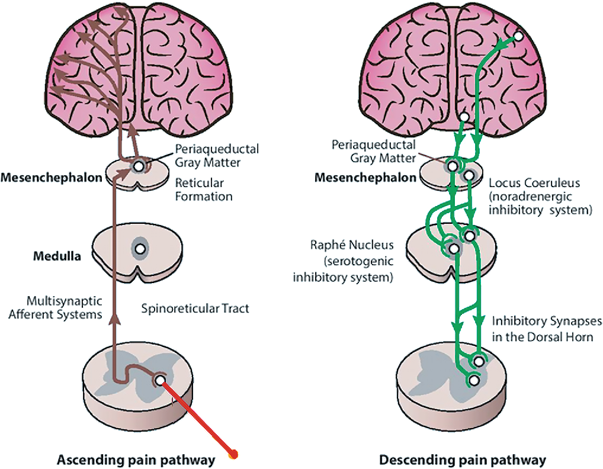

---
title: "Pain Fundamentals: Pain Modulation"
---

Pain is not a simple one-way signal from the body to the brain. Nociceptive signals can be amplified or inhibited at multiple levels of the nervous system.

This process is called **pain modulation**.

In simple terms, pain modulation helps explain why the same injury may feel different depending on context, attention, sleep, stress, mood, prior experience, and expectation. This does not mean the pain is “psychological.” It means the nervous system can turn pain signaling up or down.

## Ascending transmission versus descending modulation

It is helpful to separate two related concepts:

| Concept | Meaning |
|---|---|
| **Ascending transmission** | Nociceptive information travels from the body toward the spinal cord and brain |
| **Descending modulation** | The brain and brainstem influence how strongly nociceptive signals are transmitted in the spinal cord |

Ascending pathways help send information upward. Descending pathways help regulate how much of that signal is amplified, inhibited, or allowed to continue.

## Descending modulation

The brain can influence pain processing in the spinal cord through **descending pathways**.

Several brain regions can contribute to this process, including cortical areas involved in attention and expectation, limbic regions involved in emotion and threat, and the hypothalamus, which helps coordinate autonomic and stress responses.

These regions influence the **periaqueductal gray**, an area of the midbrain involved in descending pain control. The periaqueductal gray then communicates with brainstem regions such as the **rostral ventromedial medulla**, which sends descending projections to the **dorsal horn** of the spinal cord.

This matters because the dorsal horn is where incoming nociceptive signals are first processed in the spinal cord. Descending pathways can either **inhibit** or **facilitate** pain transmission at this level. These two processes are discussed in the next sections.

## Descending inhibition

Descending inhibitory pathways reduce pain transmission in the dorsal horn.

Important neurotransmitters include:

- Serotonin
- Norepinephrine
- Endogenous opioids

These systems are clinically relevant because some pain medications partly work by enhancing descending inhibition. For example, medications that affect serotonin and norepinephrine, such as some antidepressants used in chronic pain, may help strengthen inhibitory pain pathways in selected patients.

Endogenous opioid systems are also part of the body’s natural pain control system and help explain why opioid receptors are important in pain modulation.

{fig-align="center" width="75%"}

## Descending facilitation

Descending pathways can also increase pain transmission.

This may contribute to:

- Persistent pain
- Pain amplification
- Increased pain sensitivity
- Chronic pain states

Descending facilitation is one reason pain can become more intense or persistent even when the original tissue injury is stable or healing. It also helps explain why factors such as poor sleep, stress, fear, and threat perception can worsen pain experience.

## Gate control concept

The **gate control theory** is a simplified way to understand how non-painful input can reduce pain signaling.

For example, rubbing an injured area may temporarily reduce pain because touch input can influence spinal cord processing of nociceptive signals. In simplified terms, non-painful sensory input can partially “close the gate” on pain transmission at the spinal cord level.

This is one reason some physical strategies, such as rubbing, massage, heat, cold, vibration, or movement, may temporarily change pain experience.

::: {.callout-note}
## Core idea

Pain depends on both incoming nociceptive input and nervous system modulation of that input.
:::

## Clinical relevance

Pain modulation helps explain why pain can be influenced by:

- Attention
- Expectation
- Stress
- Sleep
- Mood
- Fear
- Prior pain experiences
- Physical activity
- Social context

This does not make pain less real. It means pain is produced by a nervous system that is responsive to context.

Clinically, this matters because effective pain care often includes more than treating the tissue source alone. Sleep, graded activity, education, emotional distress, medications, procedures, and rehabilitation can all influence pain through modulation.

 

[← Previous: Sensitization](pain-fundamentals-sensitization.qmd){.btn .btn-outline-primary}

[Next: Nerve Injury →](pain-fundamentals-nerve-injury.qmd){.btn .btn-primary}
