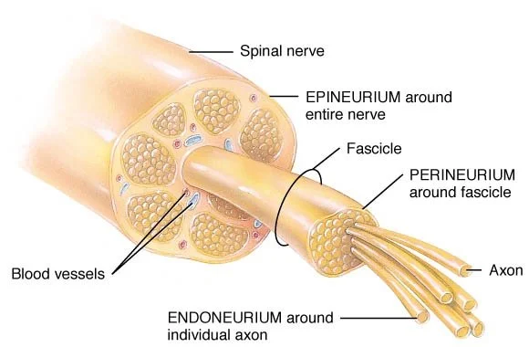
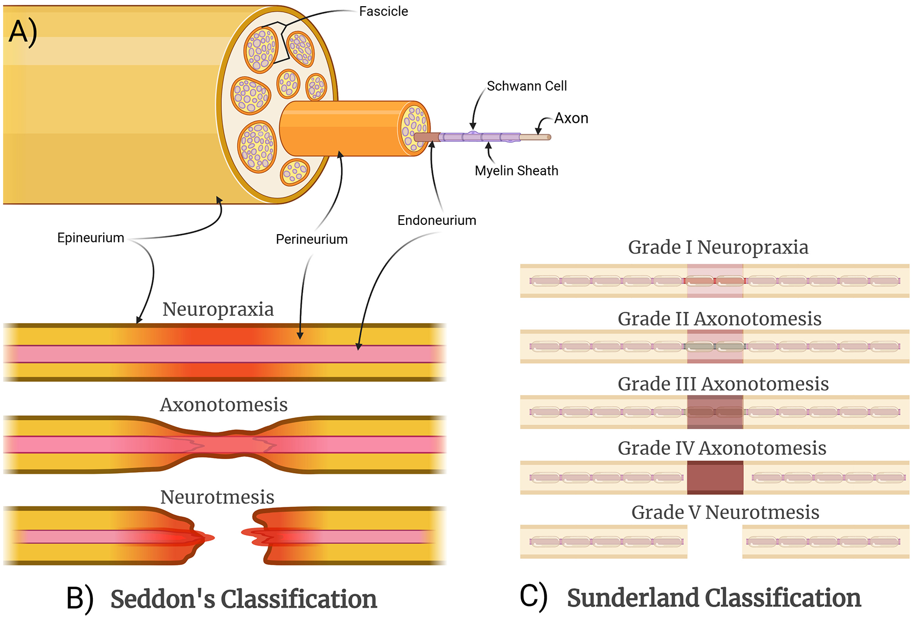

---
title: "Pain Fundamentals: Nerve Injury"
---

Nerve injury is important in pain medicine because damage to the somatosensory nervous system can produce **neuropathic pain**.

Nerve injury can affect different parts of a nerve, including:

- **Myelin**, which acts like insulation around the nerve
- **Axons**, which carry electrical signals
- **Connective tissue support structures**, which provide the scaffold for the nerve
- **Entire nerve continuity**, if the nerve is severely disrupted

The severity of injury influences both recovery potential and the likelihood of persistent symptoms.

## Basic nerve structure

A peripheral nerve is more than just a bundle of axons. It also has supporting connective tissue layers.

| Structure | Simple role |
|---|---|
| **Myelin** | Insulates axons and helps signals travel quickly |
| **Axon** | Carries the nerve signal |
| **Endoneurium** | Connective tissue around individual nerve fibers |
| **Perineurium** | Connective tissue around a fascicle, or bundle of nerve fibers |
| **Epineurium** | Outer connective tissue layer around the whole nerve |

This matters because nerve recovery depends not only on whether the axon is injured, but also on whether the surrounding scaffold remains intact.

{fig-align="center" width="55%"}

## Seddon classification

The Seddon classification is a simple way to categorize peripheral nerve injury.

| Injury type | Meaning | Recovery potential |
|---|---|---|
| **Neurapraxia** | Conduction block without axonal disruption | Best |
| **Axonotmesis** | Axon is disrupted, but connective tissue framework is at least partly preserved | Possible through regeneration |
| **Neurotmesis** | Complete nerve disruption | Worst |

In practical terms:

- **Neurapraxia** is usually the most reversible because the axon remains intact.
- **Axonotmesis** can recover if the axon regenerates along a preserved scaffold.
- **Neurotmesis** has the poorest recovery because nerve continuity is disrupted.

## Sunderland classification

The Sunderland classification gives a more detailed breakdown.

| Degree | Main structure injured | Approximate Seddon equivalent |
|---|---|---|
| **1st degree** | Myelin injury only | Neurapraxia |
| **2nd degree** | Axon injury, endoneurium preserved | Axonotmesis |
| **3rd degree** | Axon and endoneurium injured | Axonotmesis |
| **4th degree** | Fascicle/perineurium involved | Axonotmesis / severe injury |
| **5th degree** | Complete nerve transection | Neurotmesis |

The more connective tissue support is disrupted, the harder it is for regenerating axons to find the correct path back to their target.

{fig-align="center" width="65%"}

## Why nerve injury can hurt

Nerve injury can cause abnormal signaling within the somatosensory system.

This may lead to:

- Spontaneous pain
- Burning pain
- Electric or shooting pain
- Dysesthesia
- Allodynia
- Hyperalgesia
- Pain in an area with reduced sensation

One clinically important feature of neuropathic pain is that patients can have both **reduced sensation** and **pain** in the same region. This may seem contradictory at first, but it reflects abnormal nerve function rather than normal tissue warning signals.

Injured nerves may generate ectopic discharges, become more sensitive to stimulation, or form painful neuroma-like changes after trauma or surgery. These abnormal signals can then be amplified by peripheral or central sensitization.

::: {.callout-note}
## Key idea

Neuropathic pain does not require normal sensation. A damaged nerve can produce pain, numbness, tingling, or abnormal unpleasant sensations.
:::

## Regeneration and recurrent pain

If the connective tissue framework is preserved, axons may regenerate over time.

This is clinically important because some pain procedures intentionally interrupt nerve signaling without completely destroying the nerve framework. Pain relief may occur, but symptoms can recur if the nerve regenerates.

This concept helps explain why treatments such as radiofrequency ablation can provide meaningful relief for months, but may not be permanent.

## Bridge to interventional pain

Pain procedures are most useful when there is a specific target that plausibly carries the pain signal.

For example:

- A painful facet joint is supplied by predictable sensory nerves called **medial branch nerves**.
- If blocking those nerves temporarily relieves pain, this supports the idea that they are carrying clinically relevant pain signals.
- A longer-lasting procedure, such as radiofrequency ablation, may then be considered.

This approach connects anatomy, diagnosis, and treatment.

 

[← Previous: Pain Modulation](pain-fundamentals-modulation.qmd){.btn .btn-outline-primary}

[Next: Radiofrequency Ablation →](pain-fundamentals-rfa.qmd){.btn .btn-primary}
