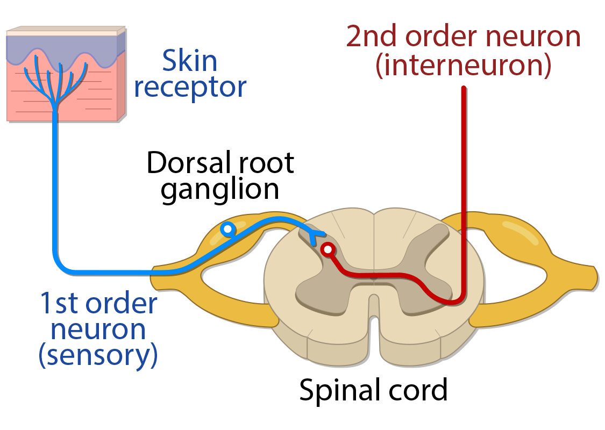
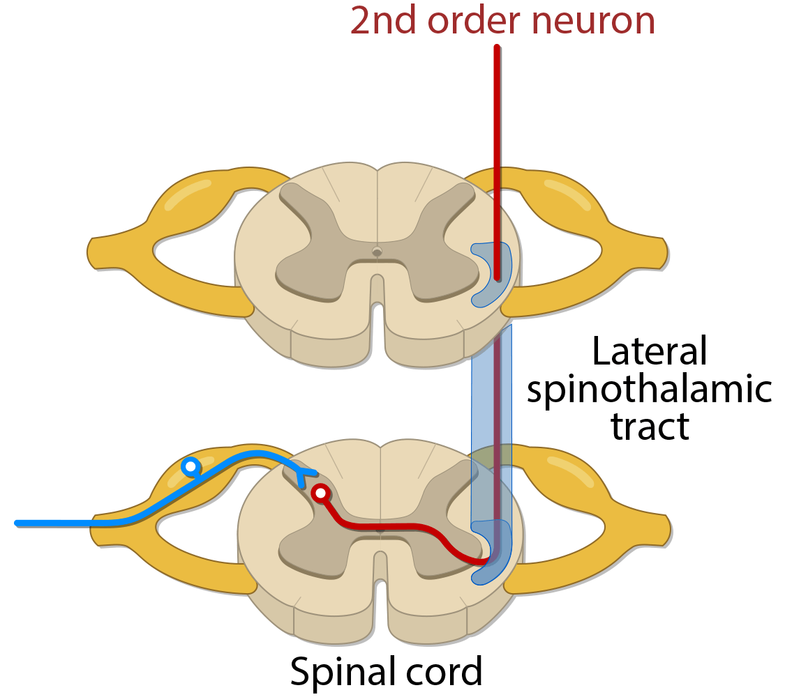
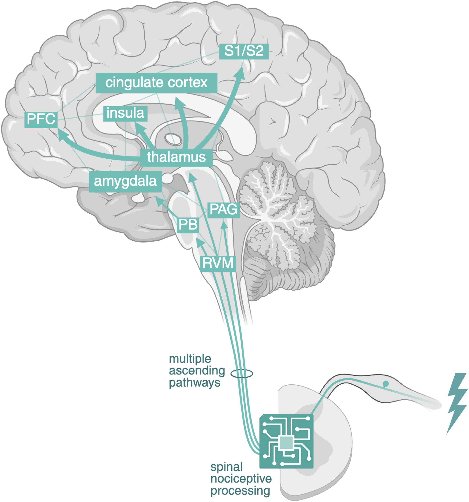
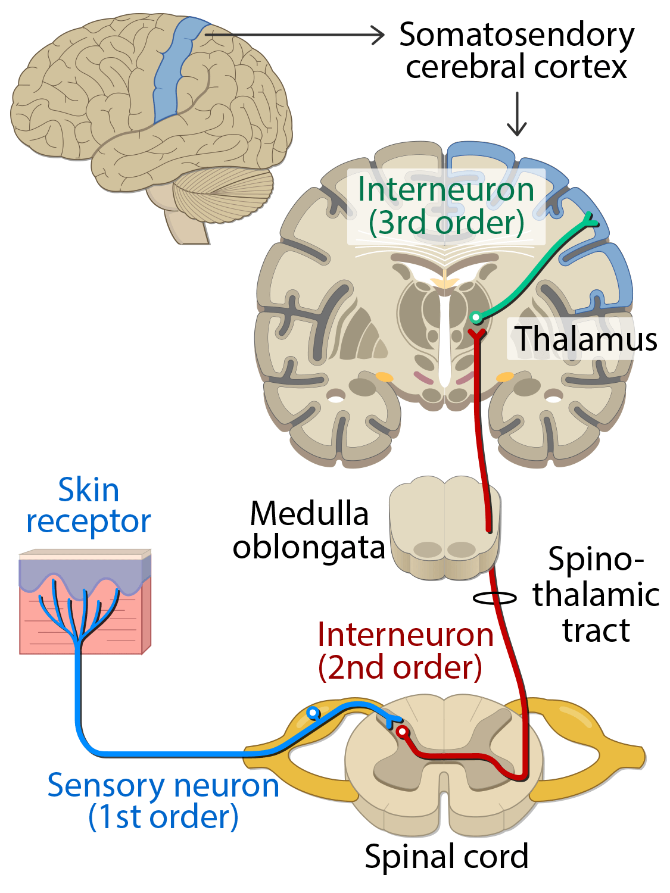

---
title: "Pain Fundamentals: Pain Pathways"
---

Pain perception begins with detection of a noxious stimulus, but the final experience of pain is produced by the brain. A useful framework is to follow the signal from the periphery, into the spinal cord, up through ascending pathways, and finally into cortical networks involved in sensation, emotion, attention, and meaning.

## Step 1: Nociceptor activation

A noxious stimulus activates peripheral **nociceptors**, which are specialized sensory nerve endings that convert potentially harmful stimuli into electrical signals through a process called **transduction**.

Examples of noxious stimuli include:

- Tissue injury
- Heat
- Cold
- Inflammation
- Mechanical pressure
- Chemical irritation

Tissue injury can also trigger an inflammatory response. Local inflammatory mediators can activate or sensitize nociceptors, making them easier to fire. This is one reason why an injured or inflamed area can become tender and painful even with relatively minor stimulation.

::: {.callout-note}
## Key idea

Nociceptors detect potentially harmful stimuli. They do not create the full experience of pain by themselves.
:::

## Step 2: Primary afferent neuron

Once the signal has been transduced, it travels from the peripheral tissue to the spinal cord along a sensory neuron. This neuron is referred to as a **first-order neuron** or a **primary afferent neuron**.

Notably, the cell bodies of these neurons are located in a structure called the **dorsal root ganglion**, which sits just outside the spinal cord. This structure is clinically important because it is a key sensory relay point and is therefore often a target of treatments aimed at modulating neuropathic or radicular pain.

{fig-align="center" width="35%"}

First-order sensory neurons can have different types of nerve fibers that each differ in what they carry, how large they are, whether they are myelinated, and how quickly they conduct signals. In general, fibers that are myelinated and larger in diameter conduct signals significantly faster than fibers that are unmyelinated and smaller in diameter.

| Fiber type | Main information | Myelin | Diameter | Conduction speed |
|---|---|---|---|---|
| **A-alpha** | Proprioception | Myelinated | 13-20 µm | 80-120 m/s |
| **A-beta** | Touch and pressure | Myelinated | 6-12 µm | 35-90 m/s |
| **A-delta** | Fast pain, mainly mechanical and thermal | Thinly myelinated | 1-5 µm | 5-40 m/s |
| **C fibers** | Slow pain, mechanical, thermal, and chemical | Unmyelinated | 0.2-1.5 µm | 0.5-2 m/s |

These fibers are important because they help explain the difference between **fast pain** and **slow pain**.

**Fast pain** is carried mainly by **A-delta fibers**. It is typically sharp, immediate, and more localized. This is often the first pain felt after a sudden noxious stimulus, such as touching something hot or being pricked by a sharp object.

**Slow pain** is carried mainly by **C fibers**. It is typically dull, aching, burning, throbbing, or poorly localized. This pain often follows the initial sharp pain and can persist after the stimulus.

::: {.callout-note}
## Simple comparison

**A-delta fibers:** fast, sharp, localized warning pain

**C fibers:** slow, dull, aching, burning, or ongoing pain
:::

**A-beta fibers** normally carry touch and pressure, not pain. However, after sensitization, A-beta input can contribute to pain from light touch. This is one mechanism of **allodynia**, where a normally non-painful stimulus becomes painful.

## Step 3: Dorsal horn processing

First-order neurons enter the spinal cord through the **dorsal root** and synapse onto **second-order neurons** in an area of the spinal cord called the **dorsal horn**. The dorsal horn is named for its location toward the dorsum, or posterior aspect, of the spinal cord.

The dorsal horn serves as an early processing site for nociceptive information, allowing signals to be strengthened, weakened, or modified before they continue upward toward the brain.

Clinically, this matters because changes in dorsal horn processing can contribute to:

- Allodynia
- Hyperalgesia
- Central sensitization
- Persistent pain amplification

## Step 4: Decussation and ascent

After synapsing in the dorsal horn, the second-order neurons cross the midline and enter the contralateral half of the spinal cord. This crossing of fibers from one side of the spinal cord to the other is called decussation.

After crossing, these signals ascend toward the brain through the **anterolateral system**, which refers to a group of ascending sensory pathways located in the anterior and lateral portions of the spinal cord.

More specifically, pain and temperature signals mainly ascend through the **lateral spinothalamic tract**. This tract is the major pathway that carries pain and temperature information from the body to the brain. There is also an **anterior spinothalamic tract**, but this is classically associated with crude touch and pressure rather than pain and temperature.

{fig-align="center" width="35%"}

## Step 5: Thalamus and cortical processing

After ascending up the spinal cord and passing through the brainstem, the second-order neurons reach a structure in the deep brain called the **thalamus**, which serves as a crucial relay station for sensory information.

For body pain and temperature, an important thalamic relay is the **ventral posterolateral nucleus**, often abbreviated as the **VPL**. At the thalamus, second-order neurons synapse onto **third-order neurons**, which then project to multiple cortical regions involved in pain perception. These regions help generate the conscious experience of pain, including where it came from, how intense it feels, how unpleasant it is, and what meaning the brain assigns to it.

Broadly, pain has both a **sensory-discriminative** component and an **affective-emotional** component. The sensory-discriminative component helps determine the location, intensity, and quality of pain, while the affective-emotional component helps determine how unpleasant, distressing, or threatening the pain feels.

Important cortical regions include:

- **Primary and secondary somatosensory cortex (S1 and S2):** location, intensity, and quality of pain
- **Insula:** internal body awareness and salience
- **Anterior cingulate cortex:** unpleasantness and emotional response
- **Prefrontal cortex:** attention, meaning, expectation, and context

{fig-align="center" width="35%"}

::: {.callout-note}
## Key idea

Pain is not processed in one single “pain center.” It is produced by a network involving sensory, emotional, attentional, and cognitive regions.

This is why two patients with similar injuries may experience pain very differently. Pain is not only a sensory signal about tissue damage; it is also shaped by emotional, attentional, and contextual processing in the brain.
:::

## Putting the pathway together

::: {.callout-tip}
## Pathway summary

Noxious stimulus → nociceptor activation → transduction → first-order neuron → dorsal root ganglion → dorsal horn synapse → second-order neuron crosses the midline → anterolateral system / spinothalamic tract → thalamus, including VPL relay → cortical pain network → conscious pain experience
:::

{fig-align="center" width="40%"}

 

[← Previous: Pain Classification](pain-fundamentals-classification.qmd){.btn .btn-outline-primary}

[Next: Sensitization →](pain-fundamentals-sensitization.qmd){.btn .btn-primary}
