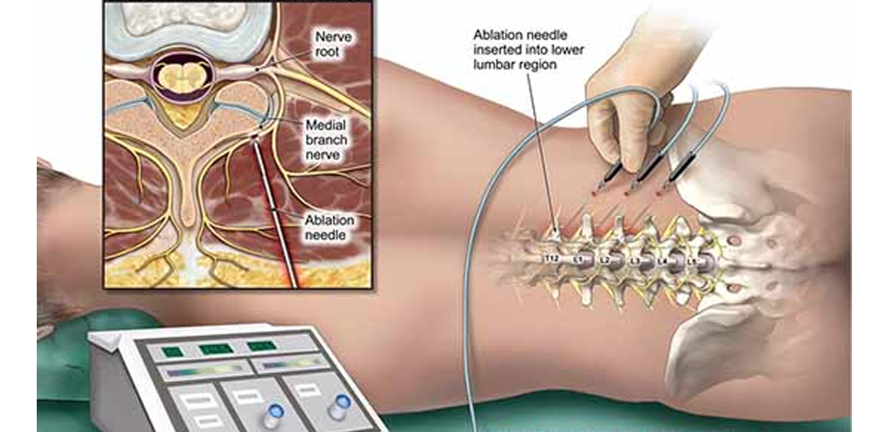

---
title: "Pain Fundamentals: Radiofrequency Ablation"
---

Radiofrequency ablation is an interventional pain procedure that uses controlled thermal injury to reduce pain transmission from a specific target nerve.

It is most useful when pain is thought to come from a specific pain generator supplied by predictable sensory nerves.

## Core principle

Radiofrequency ablation does not treat all pain globally. It targets a specific nerve or set of nerves that are believed to be carrying pain from a specific source.

A common example is **facet-mediated pain**:

- The facet joint can be a source of axial spine pain.
- The facet joint is supplied by small sensory nerves called **medial branch nerves**.
- If medial branch blocks temporarily reduce the patient’s typical pain, this supports the facet joint as a clinically relevant pain generator.
- Radiofrequency ablation can then be used to create longer-lasting interruption of those medial branch nerves.

This reflects a broader principle in pain medicine: an initial diagnostic block can help confirm the target, and a longer-lasting intervention may be considered if the diagnostic block produces meaningful relief.

{fig-align="center" width="55%"}

## Thermal neurolysis

Thermal neurolysis means intentional thermal injury to nerve tissue to reduce pain transmission.

In interventional pain medicine, this is commonly performed using radiofrequency ablation.

The goal is not to eliminate all sensation or cure every contributor to pain. The goal is to reduce nociceptive input from a specific source.

## Basic mechanism

Radiofrequency ablation uses an active electrode tip to heat tissue near a target nerve.

This creates a controlled thermal lesion.

Tissue effects can include:

- Coagulative necrosis
- Protein denaturation
- Collagen destruction
- Axonal degeneration

In practical terms, RFA produces controlled nerve injury that reduces pain signaling.

## Why relief may be temporary

RFA often injures the axon while leaving some connective tissue structure preserved.

Because the broader nerve framework may remain, the nerve can regenerate over time. This helps explain why pain relief may be meaningful but temporary.

The expected duration of benefit varies by patient, target, technique, and whether the original pain generator remains active.

::: {.callout-note}
## Core idea

RFA reduces pain by interrupting signaling from a specific target nerve. It does not cure every contributor to pain.
:::

## What RFA does not do

RFA is not a treatment for every pain condition.

For example, RFA:

- Does not reverse arthritis or degenerative structural change
- Does not treat all causes of back pain
- Does not treat radicular pain from active nerve root compression in the same way as an epidural steroid injection or decompression
- Does not help if the targeted nerve is not actually carrying the patient’s pain signal

This is why patient selection and diagnostic blocks are important.

## Types of radiofrequency treatment

| Type | Key idea |
|---|---|
| **Continuous / thermal RF** | Sustained heat creates a thermal lesion |
| **Bipolar RF** | Current passes between two active electrodes |
| **Pulsed RF** | Intermittent current is used, generally less destructive |
| **Cooled RF** | Cooling near the electrode allows heat to spread farther |
| **Cryoablation** | Extreme cold is used instead of heat |

The details differ by technique, but the shared idea is that energy is applied near a target nerve to alter pain transmission.

## Procedure safety and anatomy

The target matters. Lesioning the wrong structure may lead to ineffective treatment or unwanted sensory symptoms.

Potential issues include:

- Post-procedure pain
- Numbness
- Dysesthesia
- Neuritis
- Hypersensitivity
- Vasovagal syncope
- Rare skin or soft tissue complications

Depending on the target and anatomic region, inappropriate lesioning could also affect nearby motor or sensory structures. This is why image guidance, correct target selection, and an understanding of local anatomy are essential.

::: {.callout-warning}
## Practical teaching point

RFA can be helpful, but it works by producing controlled nerve injury. Patients should understand both the expected benefit and the possible sensory side effects.
:::

## Example: facet-mediated pain

A patient with chronic axial low back pain has a clinical pattern suspicious for facet-mediated pain. Imaging shows degenerative facet changes, but imaging alone does not prove that the facet joint is the pain generator.

A diagnostic medial branch block is performed. If the patient has meaningful temporary relief of their typical pain, this supports the medial branch nerves as appropriate targets.

If the pain later returns, radiofrequency ablation of the relevant medial branch nerves may be considered for longer-lasting relief.

::: {.callout-tip}
## Pause and think

Why is a diagnostic block often performed before radiofrequency ablation?

Show answer

A diagnostic block helps test whether the suspected target nerve is actually carrying the patient’s pain signal.

If temporarily numbing that nerve meaningfully reduces the patient’s typical pain, then a longer-lasting treatment directed at that nerve, such as RFA, is more likely to help.

:::

 

[← Previous: Nerve Injury](pain-fundamentals-nerve-injury.qmd){.btn .btn-outline-primary}

[← All Modules](modules.qmd){.btn .btn-primary}
