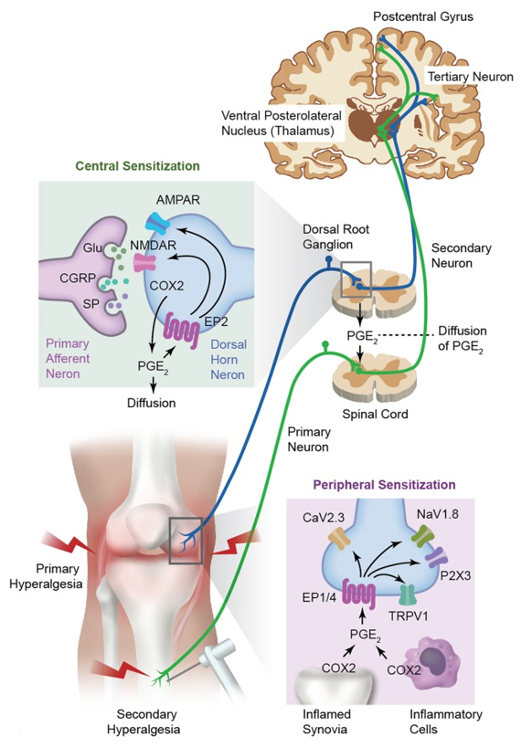

---
title: "Pain Fundamentals: Sensitization"
---

**Sensitization** refers to increased responsiveness of the pain system. In simple terms, the nervous system becomes easier to activate and may produce a stronger, more widespread, or more persistent pain response than expected.

This is clinically important because pain severity does not always match the amount of tissue damage. In some patients, pain may be amplified by changes in the peripheral or central nervous system, rather than being explained only by one injured structure.

The two major forms are:

- **Peripheral sensitization**
- **Central sensitization**

## Peripheral sensitization

**Peripheral sensitization** occurs when peripheral nociceptors become more sensitive after tissue injury or inflammation.

Normally, nociceptors require a certain level of stimulation before they fire. With peripheral sensitization, this threshold decreases, meaning a smaller stimulus can trigger pain. The same stimulus may also produce a larger pain response than it normally would.

This is often driven by inflammatory mediators released around the injured tissue, such as **prostaglandins**, **bradykinin**, **histamine**, **cytokines**, **substance P**, **CGRP**, and **nerve growth factor**. Local chemical changes, such as increased acidity or ATP release from damaged cells, can also contribute. These mediators make nociceptors easier to activate.

Clinically, this helps explain why an injured area becomes tender, sore, and more painful to touch or movement. For example, after a sunburn, light pressure on the burned skin may feel much more painful than usual.

## Central sensitization

**Central sensitization** occurs when neurons in the spinal cord and brain become more excitable and amplify incoming pain signals.

This can happen after repeated or prolonged nociceptive input. At the dorsal horn, increased release of excitatory neurotransmitters such as **glutamate**, **substance P**, and **CGRP** can increase the responsiveness of second-order neurons. Activation of **NMDA receptors** is especially important because it can make these neurons more excitable over time. At the same time, reduced inhibitory signaling through neurotransmitters such as **GABA** and **glycine** can further increase pain transmission.

As a result, the central nervous system may become more responsive to incoming signals, so pain can become more widespread, more persistent, or disproportionate to the original injury.

Clinical features can include:

- Allodynia
- Secondary hyperalgesia
- Pain spread beyond the original injury site
- Widespread pain
- Persistent pain after tissue healing
- Pain that seems disproportionate to ongoing tissue findings

Persistent pain can also disrupt sleep, mood, activity, and function. These factors can then feed back into the pain system and further increase pain sensitivity, creating a cycle that becomes harder to reverse over time.

::: {.callout-note}
## Key idea

Central sensitization does not mean the pain is imaginary. It means the nervous system has become more responsive and is amplifying pain signaling.
:::

## Case example

Consider a patient who initially has focal medial knee pain after a local knee injury.

Early on, the pain may be mostly localized to the medial knee and driven by nociceptive input from injured or inflamed tissue. If pain persists, the surrounding tissues may become more sensitive, and the patient may begin to report pain around the whole knee rather than only at the original site.

Over time, ongoing nociceptive input and reduced activity, poor sleep, fear of movement, or distress can contribute to broader pain amplification. The patient may develop diffuse sensitivity around the knee, pain with normally tolerable movements, or pain that feels disproportionate to the original tissue findings.

This example illustrates how pain can progress from a more localized nociceptive problem toward a more sensitized pain state.

## Comparison table

| Feature | Peripheral sensitization | Central sensitization |
|---|---|---|
| **Main site** | Peripheral nociceptors | Spinal cord and brain |
| **Main process** | Nociceptors become easier to activate | CNS amplifies incoming pain signals |
| **Typical pattern** | Tenderness and increased pain at the injury site | Pain spread, allodynia, disproportionate or persistent pain |
| **Hyperalgesia pattern** | Primary hyperalgesia, meaning increased pain sensitivity at the site of injury | Secondary hyperalgesia, meaning increased pain sensitivity outside the original injury site |
| **Example** | Sunburned skin feels very painful to light pressure | Pain sensitivity spreads beyond the injured area or persists after tissue healing |

{fig-align="center" width="45%"}

## Clinical takeaway

One goal of early pain management is to reduce the chance that acute pain becomes persistent and sensitized.

This does not mean all pain can be prevented from becoming chronic. However, timely education, appropriate activity, symptom control, sleep support, functional rehabilitation, and attention to psychosocial contributors can help reduce persistent nociceptive input and maintain function.

::: {.callout-tip}
## Pause and think

Why might early active management be preferable to prolonged rest after many painful musculoskeletal injuries?

Show answer

Prolonged rest can contribute to deconditioning, fear of movement, sleep disruption, and reduced function. Early active management aims to control symptoms while helping the patient maintain safe movement and gradually return to normal activity.

This can reduce persistent nociceptive input and may lower the risk of pain becoming more sensitized over time.

:::

 

[← Previous: Pain Pathways](pain-fundamentals-pathways.qmd){.btn .btn-outline-primary}

[Next: Pain Modulation →](pain-fundamentals-modulation.qmd){.btn .btn-primary}
