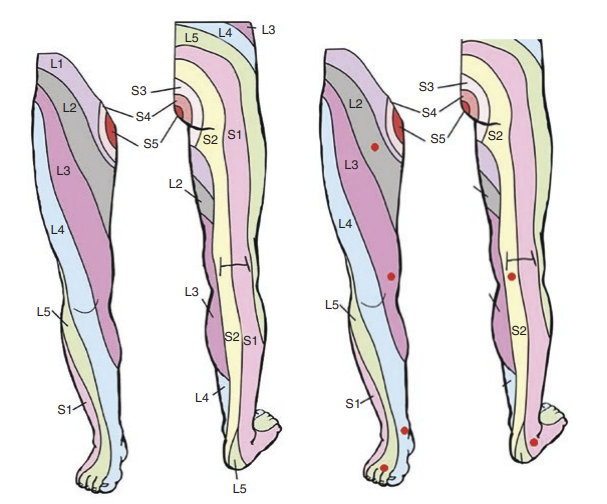
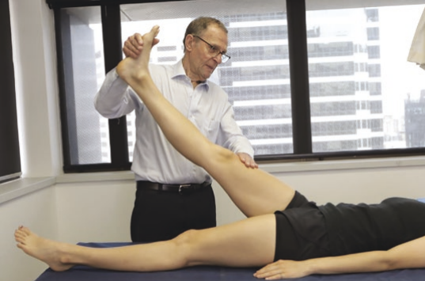
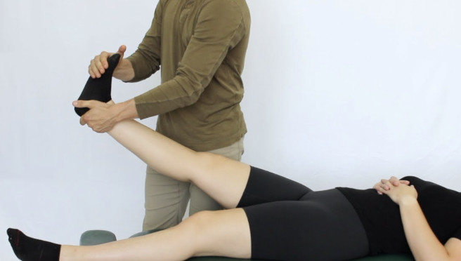
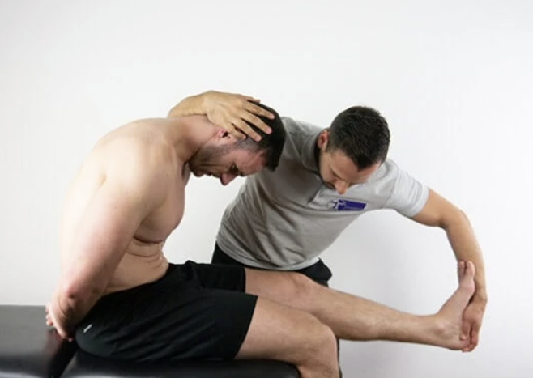
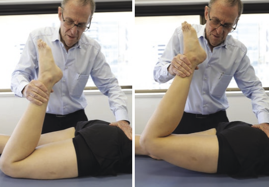
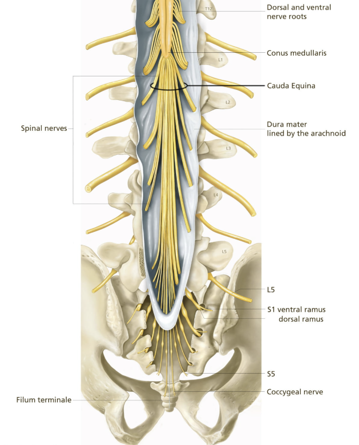

---
title: "Lumbar Radicular Pain: Clinical Presentation"
---

Lumbar radicular pain usually presents with **leg-dominant symptoms**.

Clinically, the stepwise approach is:

- Are there features suggesting radicular pain over other types of leg or back pain?
- Does the pain pattern fit a specific spinal nerve root level?
- Is there objective evidence of nerve root dysfunction?

## Timeline

The first distinction to make is the **duration of symptoms**.

**Acute** lumbar radicular pain often presents suddenly, especially after a lifting, bending, or twisting movement. In younger and middle-aged patients, this raises suspicion for an acute disc herniation irritating a nerve root.

**Chronic** lumbar radicular pain is usually more gradual or recurrent. In older patients, this is often related to degenerative narrowing of the lateral recess or neural foramen, which can irritate or compress the nerve root over time.

## Terminology

**Neuropathic pain** is a broad term that refers to pain generated from injury or disease affecting **any part of the nervous system** including nerves, nerve roots, the spinal cord, or the brain. 

Patients may describe this sort of pain as:

- Shooting
- Burning
- Electric
- Sharp
- Stabbing
- Traveling down the leg

**Radicular pain** specifically refers to pain generated by injury or disease to a **nerve root**. 

::: {.callout-note}
## Key idea

Radicular pain is a subtype of neuropathic pain. 

Therefore, all radicular pain is neuropathic pain, but not all neuropathic pain is radicular pain.
:::

**Radiculopathy** is also related, but distinct. Remember that pain is a subjective experience, so patients can have radicular pain without objective neurologic deficits. Radiculopathy, on the other hand, implies that the nerve root is not only irritated, but also functionally impaired, leading to objecitve findings on examination.

::: {.callout-note}
## Key idea

Radicular pain describes the **subjective** pain pattern. Radiculopathy describes **objective** nerve root dysfunction.
:::

| Term | Meaning |
|-|---|
| **Radicular pain** | Pain generated by irritation or inflammation of a spinal nerve root |
| **Neuropathic pain** | Pain caused by injury or disease affecting the somatosensory nervous system |
| **Radiculopathy** | Objective nerve root dysfunction, such as weakness, sensory loss, or reflex change |

## Symptom pattern

Symptoms may worsen with activities that increase nerve root tension or intradiscal pressure, such as:

- Sitting
- Bending forward
- Coughing
- Sneezing
- Valsalva

Depending on the cause, symptoms may also worsen with standing or extension. This is especially relevant when foraminal stenosis is the main driver.

::: {.callout-tip}
## Pause and think

In the opening case, the patient develops acute radiating leg pain after deadlifting. Which movement would you expect to aggravate his pain more: lumbar flexion or lumbar extension?

Show answer

**Lumbar flexion** would be more likely to aggravate his pain.

Because the symptoms are acute and started during lifting, an acute disc herniation is higher on the differential. Disc-related radicular pain is often worsened by flexion, sitting, bending forward, coughing, or Valsalva.

By contrast, pain from degenerative foraminal stenosis is often worse with **lumbar extension**, because extension can further narrow the neural foramen.

:::

## Dermatomes

A **dermatome** is an area of skin supplied mainly by one spinal nerve root.

In radicular pain, the pain or sensory symptoms may follow a dermatomal pattern. For example, irritation of the L5 nerve root often causes symptoms that travel down the lateral leg toward the dorsum of the foot.

| Nerve root | Broad sensory distribution |
|---|---|
| **L2** | Anterior upper thigh |
| **L3** | Anterior thigh and medial knee |
| **L4** | Medial leg and medial ankle |
| **L5** | Lateral leg, dorsum of foot, great toe |
| **S1** | Posterior leg, lateral foot, sole |
| **S2** | Posterior thigh and upper posterior calf |

{fig-align="center" width="45%"}

::: {.callout-note}
## Key idea

Dermatomes cover broad areas of skin and often overlap. In practice, it is helpful to test a few high-yield sensory points that are more closely associated with specific nerve roots. These areas are demonstrated in the image above with the red dots.

| Nerve root | High-yield sensory test point |
|---|---|
| **L2** | Anterior upper thigh |
| **L3** | Anterior thigh above the knee |
| **L4** | Medial malleolus of the ankle |
| **L5** | Dorsum of the great toe |
| **S1** | Lateral foot |
| **S2** | Popliteal fossa or posterior thigh |
:::

## Myotomes and reflexes

A **myotome** is a group of muscles supplied mainly by one spinal nerve root.

Myotomes help identify whether radicular pain has progressed to **radiculopathy**. Weakness in a myotomal pattern suggests that the affected nerve root is not only irritated, but also functionally impaired.

| Root | Pain/sensory distribution | Motor findings | Reflex |
|---|---|---|---|
| **L3** | Anterior thigh | Hip flexion, knee extension | Patellar may be reduced |
| **L4** | Anterior/medial leg | Knee extension, ankle dorsiflexion | Patellar |
| **L5** | Lateral leg, dorsum of foot, great toe | Great toe extension, ankle dorsiflexion, hip abduction | No reliable reflex |
| **S1** | Posterior leg, lateral foot, sole | Plantarflexion, toe walking | Achilles |

::: {.callout-tip}
## Pause and think

The same patient seems to have weakness with great toe extension on exam. Which nerve root would this make you most concerned about?

Show answer

Great toe extension is commonly used to assess the L5 nerve root. Weakness here would make L5 radiculopathy more likely.

:::

## Provocative tests

Provocative tests can support the diagnosis by increasing tension on irritated nerve roots. A positive result on these tests increases your suspicion for lumbar radicular pain. 

| Test | How it is performed | Suggests |
|---|---|---|
| **Straight leg raise** (**Lasègue test**) | With the patient lying supine, passively raise the straightened leg to about 30–70° and assess whether this reproduces radiating leg pain | Lower lumbar radicular irritation, especially L5/S1 |
| **Bragard test** | After a positive straight leg raise, slightly lower the leg until pain improves, then dorsiflex the ankle to see if radicular pain returns | Neural tension or lower lumbar radicular irritation |
| **Crossed straight leg raise** | Raise the unaffected leg and assess whether this reproduces radicular pain in the symptomatic leg | Less sensitive but more specific for disc herniation |
| **Slump test** | With the patient seated, flex the spine and neck, extend the knee, and dorsiflex the ankle to tension the neural system | Neural tension or radicular irritation |
| **Femoral stretch test** | With the patient prone or side-lying, extend the hip and flex the knee to stretch the femoral nerve | Upper lumbar radicular irritation, especially L2-L4 |

{fig-align="center" width="45%"}

{fig-align="center" width="45%"}

{fig-align="center" width="45%"}

{fig-align="center" width="45%"}

::: {.callout-caution}
## Word of caution

Be careful not to misinterpret hamstring tightness or other forms of non-radicular discomfort as a positive test. A positive result specifically refers to reproduction of the patient’s typical radiating leg pain, which often is described as a shooting pain that travels down below the knee and into the foot.
:::

::: {.callout-tip}
## Pause and think

On exam, the patient has pain radiating down the leg during a straight leg raise, but no pain during the femoral stretch test. What does this suggest?

Show answer

This pattern supports **lower lumbar nerve root irritation**, especially involving the **L5 or S1 nerve roots**.

A positive straight leg raise is more consistent with lower lumbar radicular pain, while the femoral stretch test is more useful for upper lumbar nerve root irritation, especially **L2 to L4**.

:::

## Red flags

Red flags should be screened for because not all radiating leg pain is benign.

Important red flags include:

- New urinary retention or overflow incontinence
- Saddle anesthesia
- Bilateral severe neurologic symptoms
- Progressive motor weakness
- Fever, immunosuppression, IV drug use, or concern for infection
- History of malignancy or unexplained weight loss
- Significant trauma
- Severe unremitting night pain

{fig-align="center" width="45%"}

 

[← Previous: Relevant Anatomy](radicular-pain-relevant-anatomy.qmd){.btn .btn-outline-primary}

[Next: Investigations →](radicular-pain-investigations.qmd){.btn .btn-primary}
