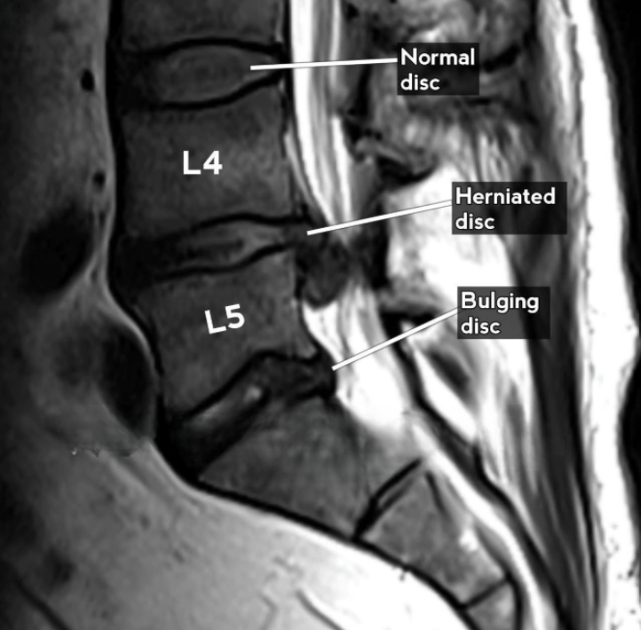
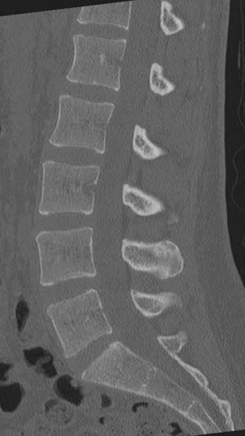
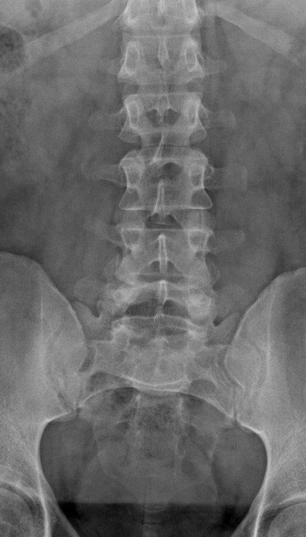
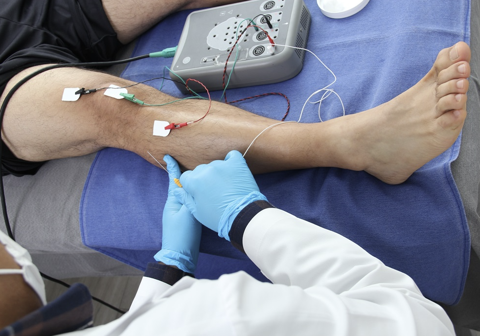

---
title: "Lumbar Radicular Pain: Investigations"
---

Most acute radicular pain does not require immediate imaging. In fact, many cases improve with just conservative management alone. However, there are specific instances where further investigation can or should be considered, depending on the severity of symptoms. 

## When imaging is not indicated

In a patient with acute radicular pain, no red flags, and no progressive or severe neurologic deficit, immediate imaging is often not needed.

This is because early imaging may show disc bulges, degenerative changes, or other abnormalities that are not necessarily causing the patient's symptoms. Imaging too early can therefore paradoxically make management less clear rather than more clear.

Initial management is instead usually guided by:

- Severity of pain
- Functional limitation
- Neurologic examination
- Presence or absence of red flags
- Response to conservative care over time

::: {.callout-note}
## Key idea

Imaging should be ordered when the result is likely to change management, not simply because radicular pain is present.
:::

## When imaging is indicated

Imaging is more useful when symptoms are:

- Persistent despite appropriate conservative management
- Severe or function-limiting
- Progressive
- Associated with objective neurologic deficit
- Associated with red flags
- Being evaluated for an epidural steroid injection or surgical referral

## Choice of imaging 

**MRI lumbar spine** is the preferred imaging test when imaging is indicated. MRI shows many soft tissue structures with great resolution, including the discs, nerve roots, spinal canal, lateral recesses, and neural foramina.

For routine lumbar radicular pain, **MRI without contrast** is usually sufficient. Contrast is generally reserved for situations where there is concern for infection, malignancy, inflammatory disease, or post-operative scar versus recurrent disc herniation.

| Investigation | Role |
|---|---|
| **MRI lumbar spine** | Best test for disc herniation, stenosis, and nerve root compression |
| **CT lumbar spine** | Useful if MRI is contraindicated or unavailable; better for bony anatomy |
| **X-ray** | Useful for quick assessment for alignment, spondylolisthesis, fracture, or degenerative change, but does not show nerve compression well |

{fig-align="center" width="45%"}

{fig-align="center" width="45%"}

{fig-align="center" width="45%"}

## Matching imaging to the clinical picture

Imaging findings must always be matched to the patient's symptoms and exam.

Disc bulges, degenerative changes, and stenosis are common in asymptomatic people. An MRI abnormality is only clinically meaningful if it fits the pain distribution, neurologic findings, and suspected root level.

For example, an L4-L5 paracentral disc herniation may be clinically meaningful if the patient has L5-pattern leg pain, weakness of great toe extension, or other findings that fit L5 involvement. The same imaging finding may be less meaningful if the patient's symptoms point to a different level or a different diagnosis.

::: {.callout-tip}
## Pause and think

Our patient has right-sided L5-pattern radicular pain. MRI shows a small right paracentral L4-L5 disc herniation and a larger left-sided disc bulge at another level. Which finding is more clinically relevant?

Show answer

The **right paracentral L4-L5 disc herniation** is more clinically relevant because it matches his right-sided L5-pattern symptoms.

The larger left-sided disc bulge may be incidental if it does not match the clinical pattern.

:::

::: {.callout-note}
## Key idea

Do not treat the MRI in isolation. Treat the patient and use imaging to support the clinical diagnosis.
:::

## Role of EMG/NCS

**EMG/NCS** can help when the diagnosis is uncertain or when there is disagreement between symptoms, exam, and imaging.

It may be useful to:

- Support a diagnosis of **radiculopathy**
- Identify chronic or active denervation
- Distinguish radiculopathy from peripheral neuropathy or plexopathy
- Clarify the affected root level when the clinical picture is unclear

{fig-align="center" width="55%"}

::: {.callout-note}
## Key idea

EMG/NCS is mainly a test of nerve function. It is more useful for confirming **radiculopathy** than for confirming radicular pain alone. It is also less useful very early in the course because denervation changes may take time to appear.
:::

## Investigation and escalation framework

A simplified practical approach is:

| Scenario | Investigation approach |
|---|---|
| Acute uncomplicated radicular pain | No immediate imaging |
| Persistent symptoms despite conservative management | MRI lumbar spine |
| Considering injection or specialist referral | MRI lumbar spine |
| Progressive or significant motor deficit | Urgent MRI and specialist assessment |
| Cauda equina symptoms | Emergent MRI and specialist assessment |
| Unclear diagnosis or clinical mismatch | Consider EMG/NCS or specialist assessment |

 

[← Previous: Clinical Presentation](radicular-pain-clinical-presentation.qmd){.btn .btn-outline-primary}

[Next: Management →](radicular-pain-management.qmd){.btn .btn-primary}
