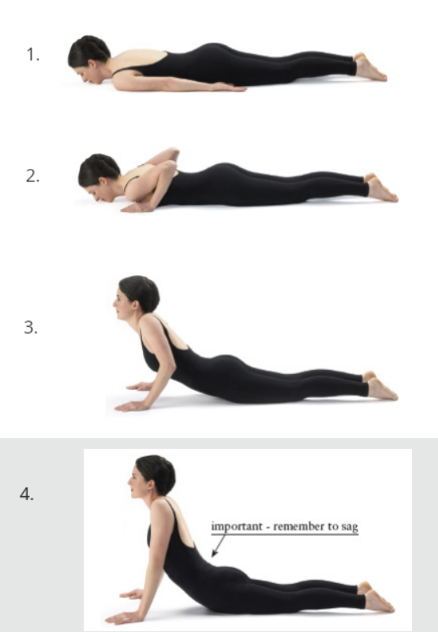
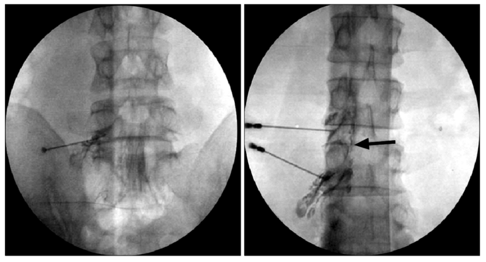
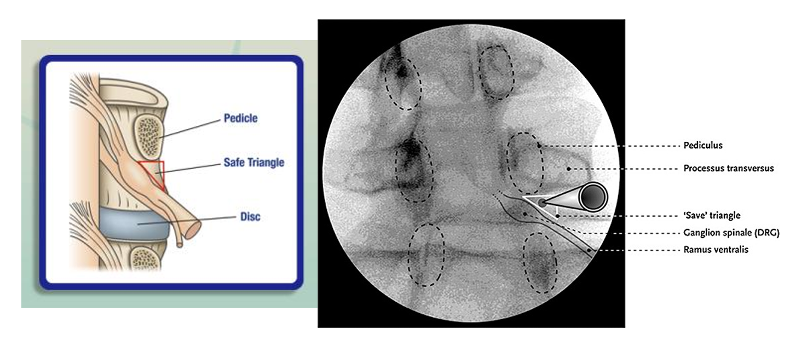
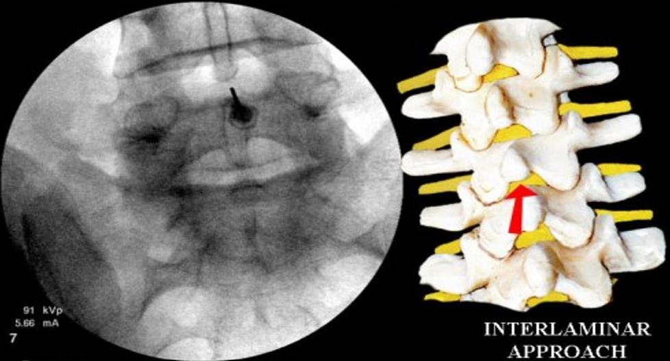
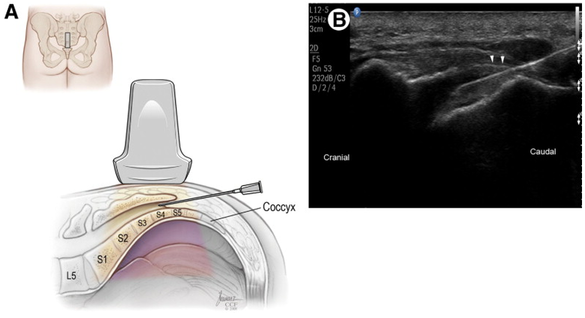

---
title: "Lumbar Radicular Pain: Management"
---

Management depends on symptom severity, duration, neurologic findings, functional impact, and the suspected cause of nerve root irritation.

Most patients without red flags or progressive neurologic deficits start with conservative management. The goals are to reduce pain, maintain function, support recovery, and monitor for worsening neurologic findings.

## Education and natural history

Many cases of lumbar radicular pain improve over time. This is especially true for acute radicular pain related to disc herniation, where inflammation can settle and the herniated disc material may regress.

Patients should be encouraged to avoid prolonged bed rest and continue gentle activity as tolerated. The goal is to encourage gradual return to function as tolerated, not complete immobilization. 

Patients should also be counselled on urgent symptoms, including new bladder dysfunction, saddle anesthesia, bilateral severe symptoms, or progressive weakness.

::: {.callout-note}
## Key idea

Initial management is usually not complete rest. It is symptom control, safe movement, and monitoring for neurologic worsening.
:::

## Medications

Medications can help reduce pain enough for the patient to move, sleep, and participate in rehabilitation.

Common options include:

| Medication type | Role |
|-|---|
| **Acetaminophen** | May provide modest analgesic benefit |
| **NSAIDs** | Useful when inflammation is contributing, if no contraindications |
| **Neuropathic agents** | May be considered for persistent neuropathic features, though benefit is variable |
| **Short oral steroid course** | Sometimes used in acute radicular pain, though benefit is variable |
| **Opioids** | Generally avoided; if used, should be reserved for select severe acute cases and for the shortest reasonable duration |

::: {.callout-caution}
## Word of caution

Medications do not fix the underlying anatomy. Their role is to reduce symptoms enough to support function and recovery.
:::

## Physiotherapy and rehabilitation

Physiotherapy focuses on reducing symptom irritability, improving movement tolerance, and restoring function. The goal is not simply to “stretch the nerve,” but to help the patient move safely and gradually return to normal activity.

Common components include:

- Education
- Activity modification
- Graded return to activity
- Directional preference exercises
- Neural mobility exercises
- Hip and core strengthening
- Functional rehabilitation

Some patients may also benefit from identifying a **directional preference**, meaning symptoms improve with repeated movement in one direction. McKenzie-based exercises are one example of this approach. For disc-related radicular pain, extension-based movements may help some patients, but this is not universal. The useful direction depends on the patient’s symptom response.

{fig-align="center" width="35%"}

A helpful sign is **centralization**, where pain moves out of the leg and closer to the spine. By contrast, **peripheralization** means pain moves farther down the leg or becomes more intense distally, suggesting that the movement may be aggravating the nerve root.

::: {.callout-note}
## Key idea

Physiotherapy should be guided by symptom response. A movement that helps one patient with radicular pain may worsen symptoms in another.
:::

## Epidural steroid injections

Epidural steroid injections can be considered when lumbar radicular pain is severe, function-limiting, persistent, or not improving with conservative care. The goal is to deliver anti-inflammatory medication into the epidural space near an irritated nerve root. This can reduce nerve root inflammation and improve pain enough for the patient to move, sleep, and participate in rehabilitation.

::: {.callout-important}
## Clinical relevance

Remember that in interventional pain, the procedure target should match the clinical syndrome and the imaging finding. Injections are not simply indicated for abnormal MRI findings in the absence of clinical symptoms.
:::

### Transforaminal epidural steroid injection

A **transforaminal epidural steroid injection** targets medication near a specific nerve root through the neural foramen. 

This is often the most targeted epidural approach when the patient has clear unilateral radicular pain that matches a specific nerve root on history, exam, and imaging. For example, if the patient has right L5-pattern radicular pain and MRI shows a right L4-L5 paracentral disc herniation affecting the traversing L5 nerve root, a right L5-targeted transforaminal epidural steroid injection may be considered.

{fig-align="center" width="60%"}

Under fluoroscopy, the target is commonly identified using an oblique view of the neural foramen. The classic target region is near the inferior aspect of the pedicle ("6 o'clock position") within the so-called **safe triangle**.

{fig-align="center" width="75%"}

### Interlaminar epidural steroid injection

An **interlaminar epidural steroid injection** accesses the epidural space from a posterior approach between adjacent laminae.

Compared with a transforaminal injection, the medication is usually delivered more centrally into the posterior epidural space and may spread more broadly. This can be useful when symptoms are less clearly limited to one nerve root, when broader epidural spread is desired, or when the anatomy makes a transforaminal approach less suitable.

{fig-align="center" width="50%"}

### Caudal epidural steroid injection

A **caudal epidural steroid injection** accesses the epidural space through the sacral hiatus. This approach can provide broader spread through the lower lumbar and sacral epidural space. It may be useful when multilevel symptoms are present, when post-surgical anatomy makes other approaches more difficult, or when a less targeted but broader epidural approach is preferred.

{fig-align="center" width="60%"}

::: {.callout-note}
## Key idea

Transforaminal injections are usually the most target-specific.

Interlaminar injections provide broader posterior epidural spread.

Caudal injections provide even broader lower lumbar or sacral epidural spread.
:::

## Surgery

Surgery is not required for most cases of lumbar radicular pain, but it becomes more relevant when there is significant or progressive neurologic dysfunction, severe persistent symptoms, or a clear structural lesion that matches the clinical picture.

Common reasons to consider surgical referral include:

- Progressive motor weakness
- Suspected cauda equina syndrome
- Persistent severe radicular pain despite appropriate nonoperative care
- Function-limiting symptoms with concordant imaging
- Severe structural compression that matches the patient's symptoms and exam

::: {.callout-important}
## Red flag

Suspected cauda equina syndrome requires emergent assessment and emergent MRI.
:::

## Acute versus chronic management

Management differs slightly depending on whether symptoms are acute or chronic.

In **acute lumbar radicular pain**, the main goal is to reduce pain, maintain mobility, and allow time for natural recovery. This usually starts with education, activity modification, medications, and physiotherapy. If pain is severe, function-limiting, or not improving, an epidural steroid injection can be considered to reduce nerve root inflammation and help the patient participate in recovery.

In **chronic lumbar radicular pain**, the focus shifts toward confirming the pain generator and setting realistic expectations. Symptoms should match the suspected nerve root level on history, exam, and imaging. Epidural steroid injection may still be useful, especially for leg-dominant symptoms, but the goal is often symptom control rather than cure. If injections provide meaningful but temporary benefit, repeat injection may be reasonable. If there is persistent severe compression, progressive deficit, or disabling symptoms despite nonoperative care, surgical referral becomes more relevant.

## Management and escalation framework

### Acute lumbar radicular pain

A simplified practical approach is:

| Scenario | Management approach |
|---|---|
| Mild or moderate symptoms | Education, activity modification, medications, physiotherapy |
| Severe or function-limiting symptoms | Consider earlier MRI if not improving or if intervention is being considered |
| Persistent leg-dominant symptoms with concordant imaging | Consider epidural steroid injection |
| Progressive motor weakness | Urgent imaging and specialist assessment |
| Suspected cauda equina syndrome | Emergency assessment and emergent MRI |
| Persistent disabling symptoms with clear compression | Consider surgical referral |

### Chronic lumbar radicular pain

A simplified practical approach is:

| Scenario | Management approach |
|---|---|
| Chronic leg-dominant symptoms | Confirm symptoms, exam, and imaging are concordant |
| Clear target on imaging | Consider epidural steroid injection for symptom control |
| Meaningful but temporary injection response | Repeat injection may be reasonable |
| Persistent severe symptoms despite nonoperative care | Consider surgical referral if there is a treatable structural cause |
| Progressive neurologic deficit | Urgent imaging and specialist assessment |

 

[← Previous: Investigations](radicular-pain-investigations.qmd){.btn .btn-outline-primary}

[Next: Summary →](radicular-pain-summary.qmd){.btn .btn-primary}
