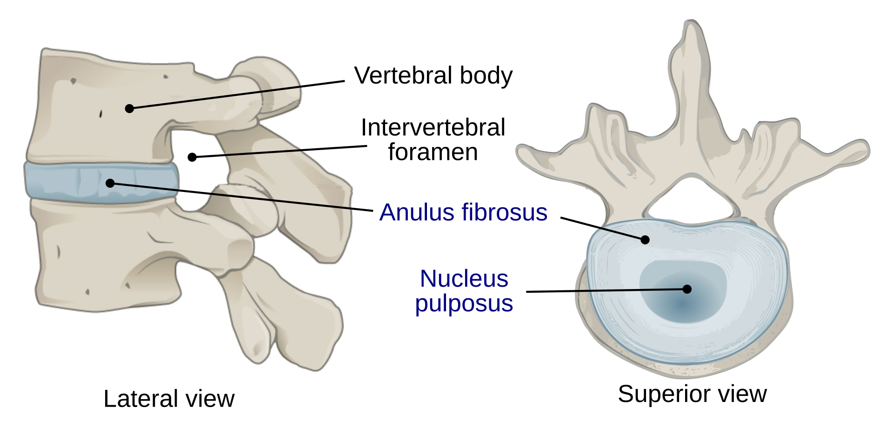
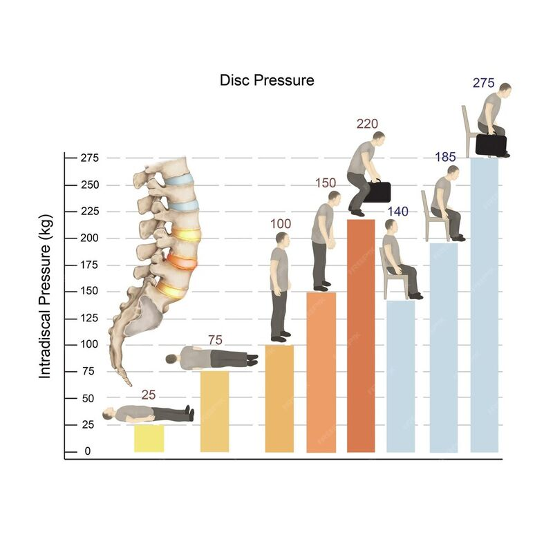
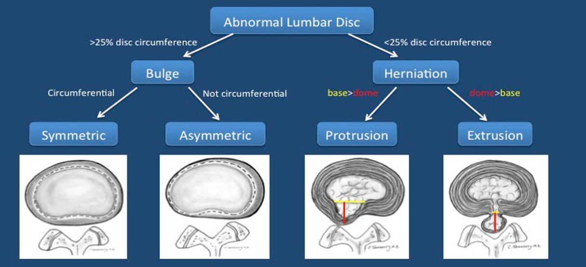
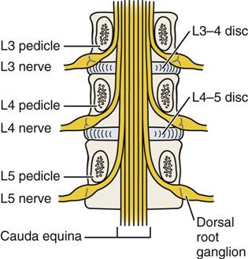
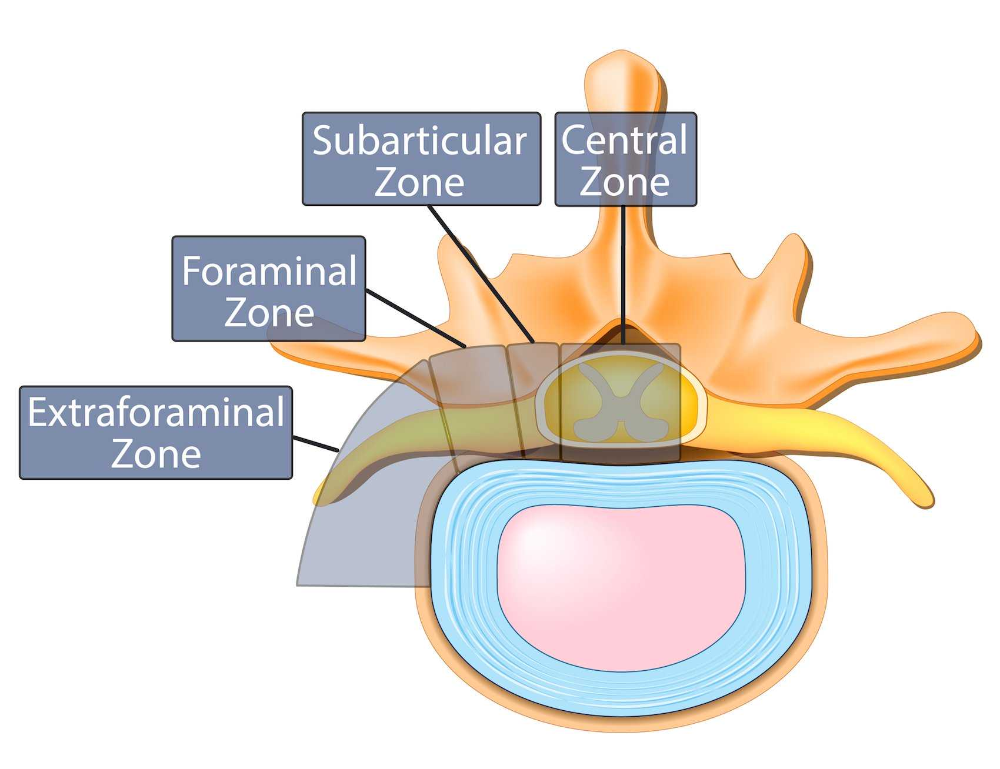

---
title: "Lumbar Radicular Pain: Relevant Anatomy"
---

Radicular pain is easier to understand when you connect three pieces of anatomy:

- The **intervertebral disc**
- The **spinal nerve roots**
- The **spaces where these nerve roots travel**

The key idea is that radicular pain occurs due to irritation of a spinal nerve root. The clinical question then becomes: 
- Where in the spine is this irritation occurring?
- What structures are causing this irritation?

Before we proceed, there are two important caveats to this module:

- This module focuses mainly on **lumbar radicular pain**, since this is the most common clinical presentation of radicular pain. However, it is important to highlight that patients can also experience **cervical radicular pain**, which originates from the cervical spine and typically presents with neck and upper limb symptoms. Cervical radicular pain will not be focused in this module; it will instead be covered separately in the Cervical Radicular Pain module.
- This module also focuses mainly on **disc herniation**, which is a common cause of lumbar radicular pain, especially in younger and middle-aged patients. However, it is important to highlight that, in older patients, lumbar radicular pain is more often due to chronic degenerative changes in the spine, such as osteophyte formation, narrowing of the nerve root spaces, or thickening of the ligamentum flavum. This module will comment on degenerative narrowing, but disc herniation will be the main focus.

## The intervertebral disc

**Intervertebral discs** are fibrocartilaginous structures that sit between adjacent vertebral bodies. They essentially act like load-bearing cushions between the vertebrae.

Their major functions include:

- Absorbing compressive forces
- Distributing load across the spine
- Allowing controlled movement between adjacent vertebrae
- Helping maintain disc height and foraminal space

Each intervertebral disc has two major components:

- The **nucleus pulposus** is the gelatinous central portion of the disc. It is rich in water and proteoglycans, which helps it absorb compression and distribute load.
- The **annulus fibrosus** is the tougher outer ring of the disc. It is made of concentric collagen layers, which helps it resist tension, shearing, and rotational forces.

The interface between the disc and the adjacent vertebral body is called the **cartilaginous endplate**. The endplate is important because adult discs have very limited direct blood supply; instead, nutrients and waste products mainly move by diffusion across the endplate. This limited vascularity helps explain why discs have limited healing potential after injury.

{fig-align="center" width="50%"}

::: {.callout-note}
## Key idea

The disc is not just a passive spacer between bones. It is a load-bearing structure that helps absorb compression, distribute force, and maintain the space available for nearby nerve roots.
:::

## Disc loading and degeneration

Disc injury is often related to a combination of **load**, **position**, and **movement**.

Flexion increases pressure on the anterior part of the disc and can push disc material posteriorly. Rotation and twisting add shear forces across the annulus fibrosus. When these forces are combined, such as bending forward while twisting or lifting, the annulus is placed under even greater stress, further increasing the risk of injury.

Common examples include:

- Deadlifting with poor form
- Shoveling
- Lifting a heavy object while twisting, such as luggage or a loaded bag

{fig-align="center" width="50%"}

In addition, discs can lose water and proteoglycan content over time, which reduces their ability to distribute load and makes them more vulnerable to different disc injury patterns.

## Disc displacement terminology

Disc-related terms can be confusing because they sound similar. One helpful way to organize them is to first separate **bulges** from **herniations**.

A **disc bulge** is a broad-based extension of disc tissue beyond the normal disc margin. It involves a larger portion of the disc circumference, often described as more than 25%. A bulge can be:

- **Symmetric**, where the disc extends outward relatively evenly
- **Asymmetric**, where the broad-based extension is greater on one side

A **disc herniation** is more focal. It involves a smaller portion of the disc circumference, often described as less than 25%. Herniations are usually divided into:

- **Protrusion**, where the displaced disc material remains broader at its base than at its outward extension.
- **Extrusion**, where the displaced disc material extends farther outward and has a narrower connection to the parent disc.

A **sequestration** is an extreme form where herniated disc material completely separates from the parent disc.

{fig-align="center" width="75%"}

::: {.callout-caution}
## Word of caution

These terms are useful, but they should not be interpreted in isolation. Imaging findings need to be matched to the patient's symptoms and neurologic examination. A dramatic-looking disc finding is not always the cause of pain, and a small herniation can sometimes cause significant symptoms if it irritates the relevant nerve root.
:::

::: {.callout-tip}
## Pause and think

Which disc finding would you expect to have the worst prognosis: a bulge, protrusion, extrusion, or sequestration?

Show answer

**Sequestration** sounds the most severe because a fragment of disc material has separated from the parent disc. However, it does not automatically have the worst long-term pain prognosis. Sequestered fragments can sometimes be reabsorbed by the body over time.

By contrast, broad-based degenerative bulges may be less dramatic, but they can be frustrating because they are often more diffuse and may not provide a clear surgical or interventional target.

The main teaching point is that the most dramatic imaging term is not always the same as the most persistent or most treatable pain problem.

:::

## How discs cause radicular pain

A disc herniation can cause radicular pain through two main mechanisms:

- **Mechanical compression**
- **Chemical inflammation**

Mechanical compression occurs when displaced disc material physically narrows the space around a nerve root. This can occur in the spinal canal, lateral recess, neural foramen, or extraforaminal region depending on the location of the herniation.

Chemical inflammation occurs because disc material and local inflammatory mediators can irritate the nerve root even when compression is not severe.

This explains why the degree of pain does not always perfectly match the size of the herniation seen on imaging. A large herniation may be minimally symptomatic if it is not irritating a clinically relevant nerve root, while a smaller herniation may cause severe radicular pain if it contacts and inflames the right nerve root.

::: {.callout-note}
## Key idea

Radicular pain is not always just a “pinched nerve.” It can involve both **nerve root compression** and **nerve root inflammation**.
:::

## Spinal nerve roots and nerve root spaces

The concept of **traversing** versus **exiting** nerve roots is high-yield because it explains why the level of a disc herniation does not always match the level of the affected nerve root. To better understand this we first need to define what determines whether a nerve root is traversing or exiting at a specific level, and what spaces these nerve roots pass through.

At a given lumbar disc level, there are usually two nerve roots to think about, and each travels through a different space:

| Nerve root | Space | Definition |
|---|---|---|
| **Exiting nerve root** | **Neural foramen** | The nerve root that exits the spinal canal through the neural foramen at that disc level |
| **Traversing nerve root** | **Lateral recess** | The nerve root that continues downward through the lateral recess before exiting at the next level |

{fig-align="center" width="35%"}

::: {.callout-note}
## Key idea

A useful rule of thumb in the lumbar spine is that, at any given disc level, the **exiting nerve root** corresponds to the upper vertebra, while the **traversing nerve root** corresponds to the lower vertebra.

For example, at **L4-L5**, the **L4 nerve root** is the exiting nerve root because it exits below the L4 pedicle. The **L5 nerve root** is the traversing nerve root because it has not exited yet; instead, it continues downward through the lateral recess before exiting at the next level.
:::

## Herniation zones

The distinction between exiting and traversing nerve roots matters because the direction of a disc herniation helps determine which nerve root is affected. More lateral herniations can involve the neural foramen and affect the exiting nerve root, while more central or paracentral herniations can involve the lateral recess and affect the traversing nerve root.

The table below summarizes the various directions of disc herniation and the affected nerve roots:

| Herniation location                             | Description                                                                 | Root usually affected              | Example at L4-L5                                                       |
| ----------------------------------------------- | --------------------------------------------------------------------------- | ---------------------------------- | ---------------------------------------------------------------------- |
| **Central**                                     | Disc material herniates toward the middle of the spinal canal               | May affect multiple roots if large | Severe central compression can raise concern for cauda equina syndrome |
| **Paracentral / subarticular / lateral recess** | Disc material herniates just lateral to the midline into the lateral recess | Traversing nerve root              | L5 root                                                                |
| **Foraminal**                                   | Disc material extends into the neural foramen                               | Exiting nerve root                 | L4 root                                                                |
| **Extraforaminal / far lateral**                | Disc material extends beyond the neural foramen                             | Exiting nerve root                 | L4 root                                                                |

{fig-align="center" width="40%"}

::: {.callout-warning}
## Urgent assessment

Central herniations are clinically important because a large central herniation can compress multiple nerve roots within the spinal canal. Severe compression of the cauda equina can cause bladder dysfunction, bowel dysfunction, saddle anesthesia, bilateral symptoms, or progressive neurologic deficits. These features require urgent assessment.
:::

::: {.callout-tip}
## Pause and think

At the **L4-L5 disc level**, which nerve root is more likely affected by a paracentral disc herniation?

Show answer

A paracentral disc herniation at **L4-L5** usually affects the **traversing L5 nerve root**.

At this disc level, the L4 nerve root is the exiting root, while the L5 nerve root is still traveling downward through the lateral recess.

:::

 

[← Previous: Introduction](radicular-pain-introduction.qmd){.btn .btn-outline-primary}

[Next: Clinical Presentation →](radicular-pain-clinical-presentation.qmd){.btn .btn-primary}
